# Aardvarkland WMS

**Full-stack platforma pro řízení skladových operací**

[**▶ Otevřít interaktivní preview / Open the interactive preview**](https://maxmilianbaron.github.io/Aardvarkland-WMS/)

Aardvarkland WMS je plnohodnotný systém pro řízení malých a středně velkých skladů. Pokrývá každodenní práci skladníků, řízení provozu vedoucími i správu systému — od příjmu a zásob přes RF workflow, vychystávání a balení až po expedici, tisk a integrace.

Tento veřejný repozitář slouží jako bezpečné interaktivní preview produktu. Ukazuje reálné obrazovky, role a pracovní postupy Aardvarkland WMS, ale používá izolovaná ukázková data a není připojený k produkční databázi ani zákaznickému prostředí.

**English version:** [jump to the English section](#english)

## Česky

### Interaktivní preview

Veřejné preview je dostupné přes GitHub Pages:

```text
https://maxmilianbaron.github.io/Aardvarkland-WMS/
```

Pro lokální spuštění stačí v kořeni repozitáře spustit:

```powershell
python -m http.server 4173
```

A otevřít:

```text
http://127.0.0.1:4173
```

### Náhled produktu

<table>
  <tr>
    <td><strong>Skladník: RF a pracovní kontext</strong><br>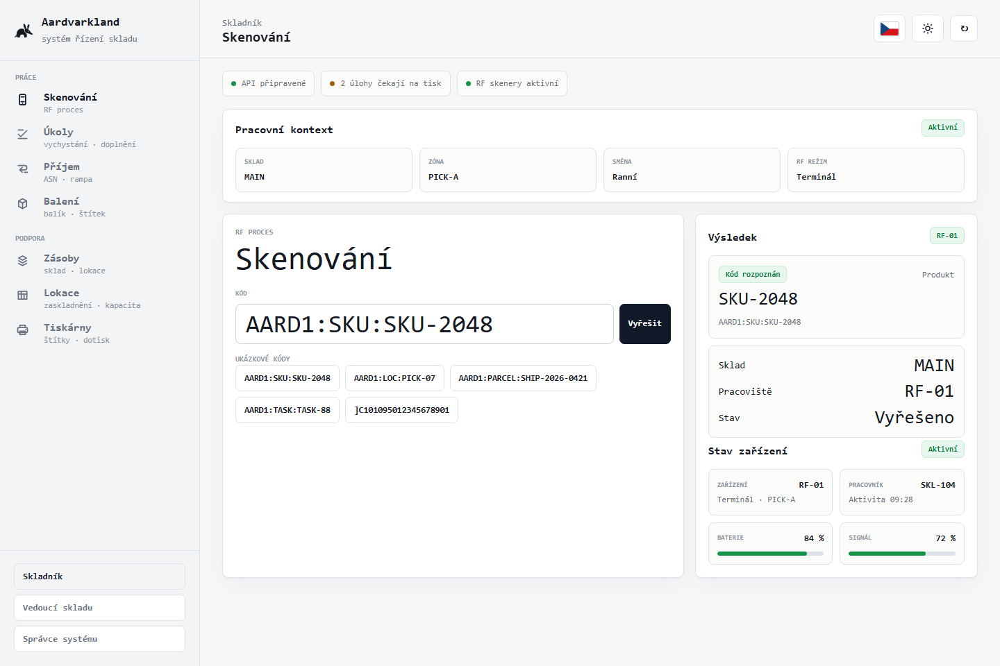</td>
    <td><strong>Skladník: úkolový tok</strong><br>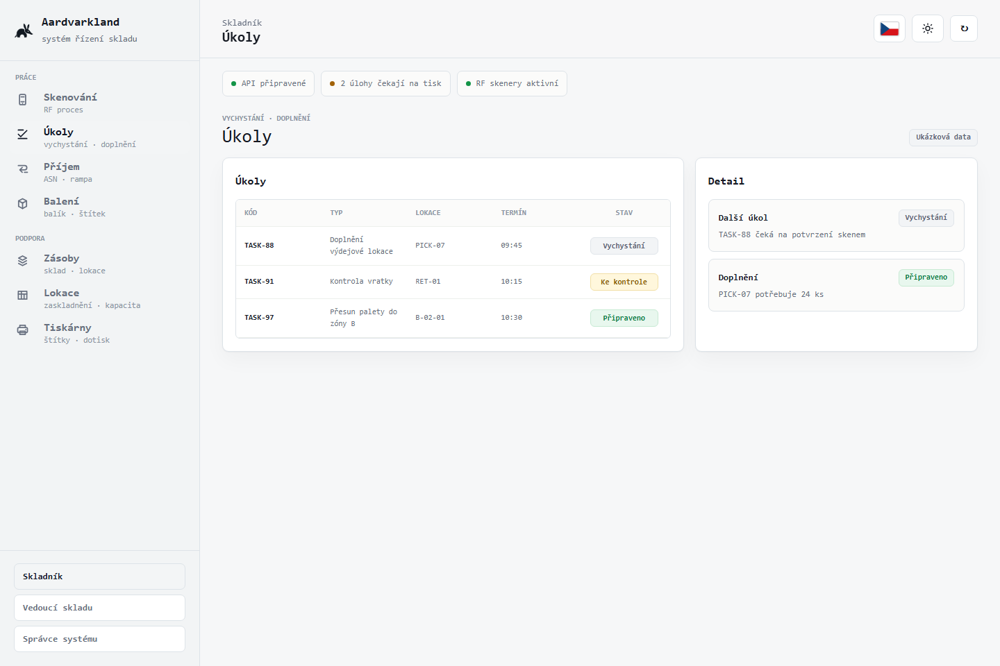</td>
  </tr>
  <tr>
    <td><strong>Zásoby</strong><br>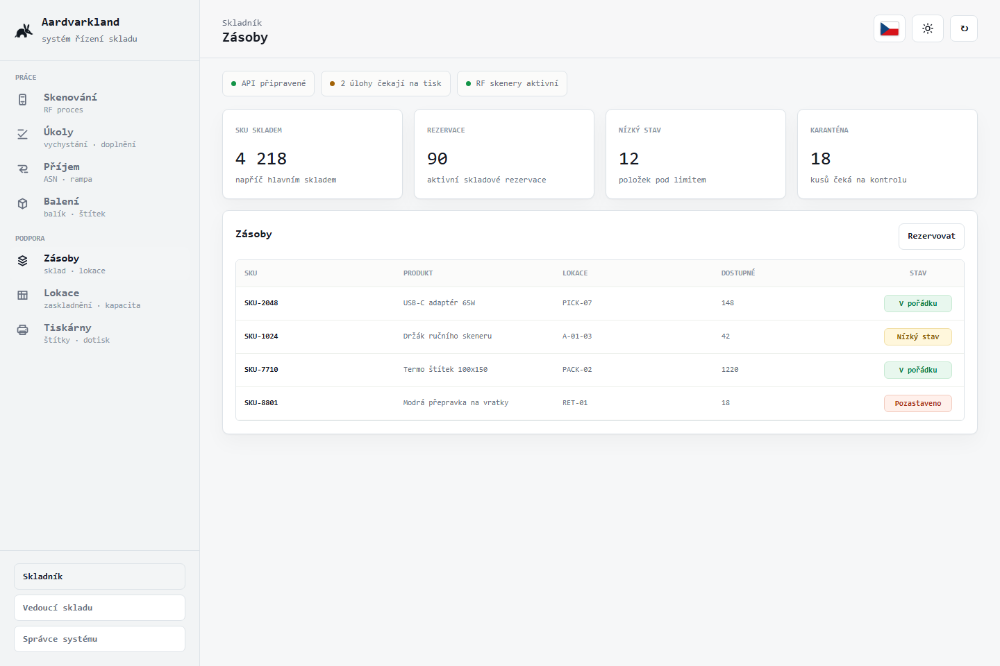</td>
    <td><strong>Skenery a tisková fronta</strong><br>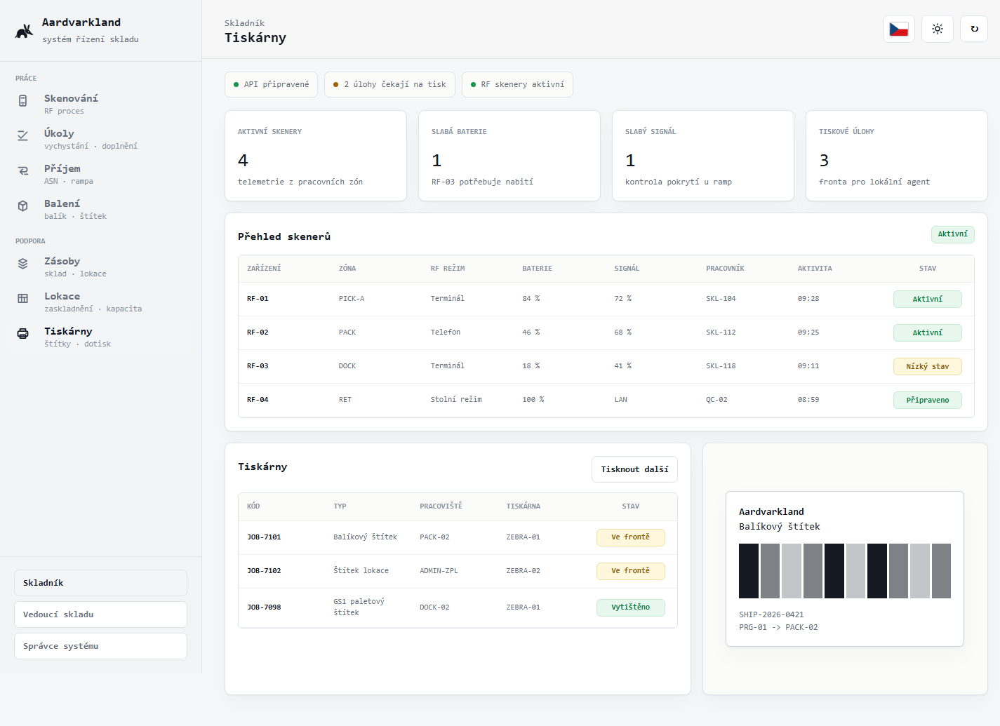</td>
  </tr>
  <tr>
    <td><strong>Vedoucí: přehled</strong><br>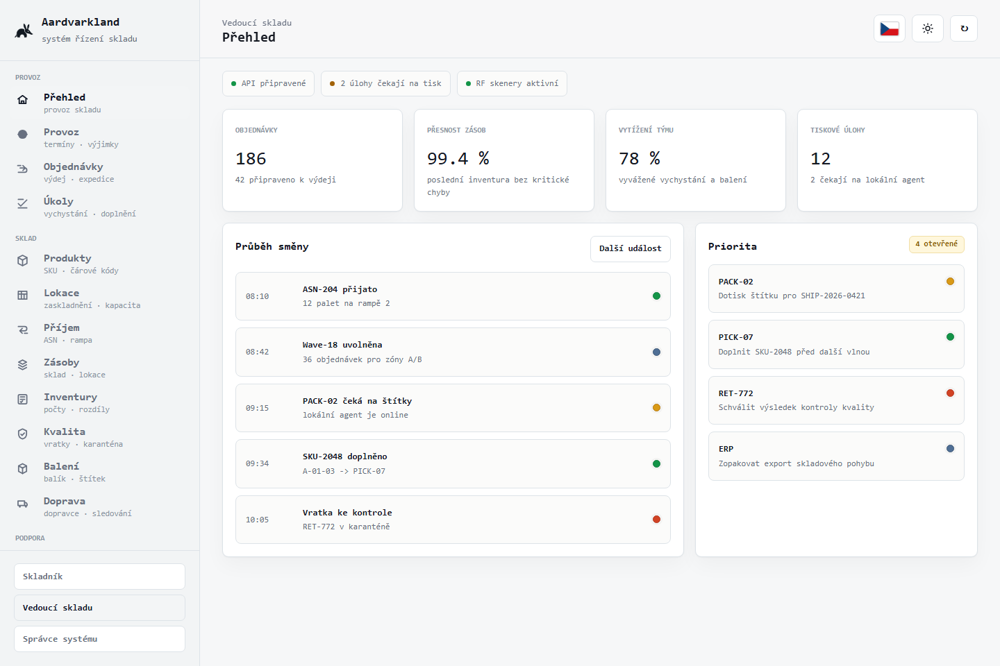</td>
    <td><strong>Control Tower</strong><br>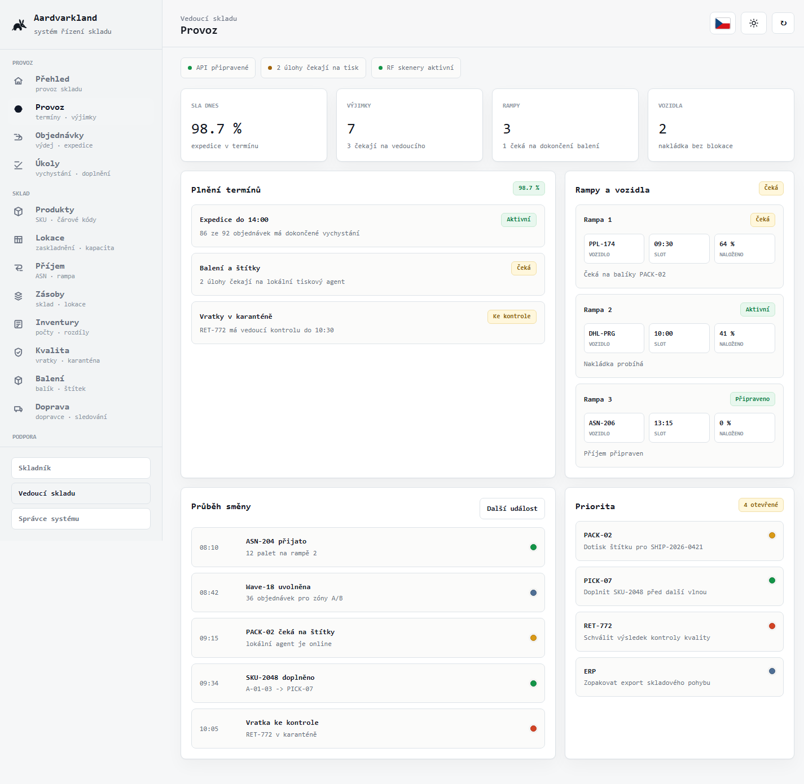</td>
  </tr>
  <tr>
    <td><strong>Správce: stabilita</strong><br>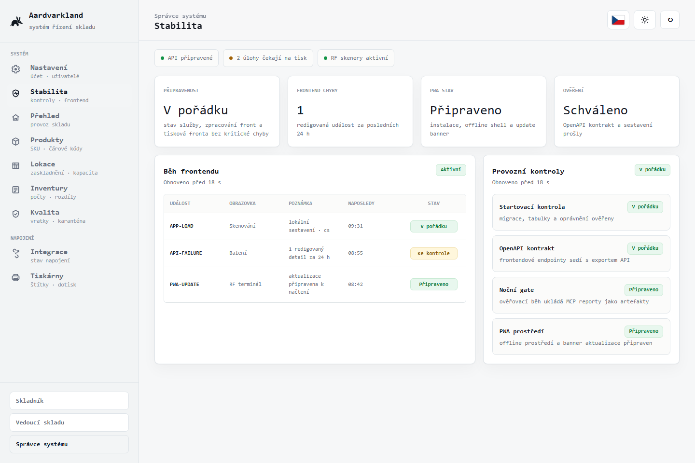</td>
    <td><strong>Správce: integrace</strong><br>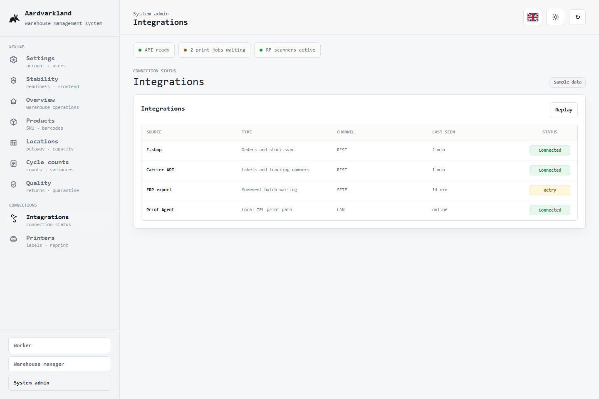</td>
  </tr>
  <tr>
    <td><strong>Správce: přehled</strong><br>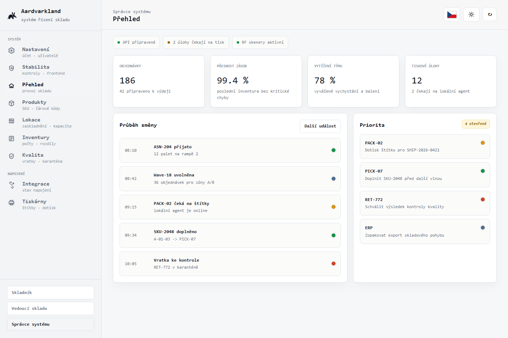</td>
    <td><strong>Mobilní RF</strong><br>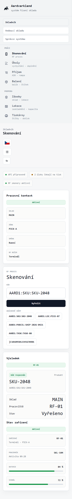</td>
  </tr>
</table>

### Co preview obsahuje

| Oblast | Co je možné projít |
|---|---|
| Skladník | RF práce, úkoly, příjem, zásoby, lokace, balení a povolený tisk štítků |
| Vedoucí skladu | Provozní přehled, fronty, inventury, kvalita, scanner fleet health a Control Tower |
| Správce systému | Uživatelé, role, sklady, integrace, tiskárny, print agenti a stabilita systému |
| Provoz | Sklad, zóna, směna, RF režim, SLA, rampy, vozidla a pracovní kontext |
| Platforma | Čeština, angličtina, ukrajinština, světlý a tmavý režim, mobilní RF a PWA prostředí |

Přepínač rolí je součástí veřejného preview, aby bylo možné projít jednotlivé pohledy bez produkčního přihlášení. V nasazeném systému jsou role a oprávnění vynucované backendem.

### Produktové funkce

Aardvarkland WMS staví provozní pravidla a stav systému do backendu. Produkt zahrnuje:

- přihlášení, refresh tokeny, odhlášení, MFA/TOTP, role, oprávnění a přístup omezený podle skladu;
- produktovou a SKU evidenci, čárové kódy, skladové lokace, zásoby, rezervace, pohyby a auditní stopu;
- příjem, zaskladnění, úkoly, RF workflow, validaci skenů, výdej, vlny, alokaci, vychystání, balení, balíky a expedici;
- vratky, karanténu, kontrolu kvality, inventury a schvalování rozdílů;
- ZPL šablony, tiskové úlohy, tiskárny a lokální Print Agent;
- integrace, outbox, idempotenci, dopravce a sledování zásilek;
- health a readiness endpointy, startovací kontroly, graceful shutdown, alertování, stav incidentů, recovery status, retenční cleanup, audit export a databázové guardrails;
- PWA a RF aplikační prostředí, frontend runtime observability, kontrolu OpenAPI kontraktu a full-stack ověření.

### Role

**Skladník** pracuje s RF úkoly, příjmem, balením, zásobami, lokacemi a tiskem štítků v rozsahu svých oprávnění.

**Vedoucí skladu** sleduje provoz, objednávky, úkoly, fronty, inventury, kvalitu, dotisky, stav skenerů, Control Tower a integrace.

**Správce systému** spravuje uživatele, role, sklady, API a integrace, tiskárny, print agenty, šablony a provozní stabilitu platformy.

### Rozsah produktu

Referenční metrika z 25. 5. 2026:

| Rozsah | Soubory | Řádky |
|---|---:|---:|
| Backend — čistý produktový kód | 550 | 65 345 |
| Backend — celkový aplikační rozsah | 596 | 71 951 |
| Frontend — čistý produktový kód | 77 | 15 601 |
| Frontend — celkový aplikační rozsah | 92 | 16 059 |
| Celkem — čistý produktový kód | 627 | 80 946 |
| Celkem — celkový aplikační rozsah | 688 | 88 010 |

Čistý produktový kód zahrnuje samotné zdrojové soubory produktu. Celkový aplikační rozsah navíc počítá testy, migrace, konfiguraci, skripty, příklady a lokální dokumentaci. Nezahrnuje dependencies, build výstupy, generovaný Prisma client, `backend/openapi.json`, lockfile, logy, generované reporty, binární assety, modely ani zálohy.

### Hranice veřejného repozitáře

Tento repozitář prezentuje produkt, ale z bezpečnostních a obchodních důvodů nezveřejňuje celý produkční zdrojový strom. Neobsahuje produkční backendové a frontendové zdrojové kódy, `.env` soubory, tokeny, hesla, databázové dumpy, živá provozní data ani privátní zákaznické a nasazovací materiály.

Veřejné preview tedy není omezená verze produktu. Je to oddělené prezentační prostředí plnohodnotného Aardvarkland WMS.

All rights reserved by Aardvarkland Inc.

---

## English

**Full-stack warehouse management platform**

Aardvarkland WMS is a full-featured system for running small and mid-sized warehouse operations. It supports the daily work of warehouse staff, operational control for managers, and system administration — from receiving and inventory through RF workflows, picking and packing to shipping, printing, and integrations.

This public repository hosts a safe interactive product preview. It presents real Aardvarkland WMS screens, roles, and workflows while using isolated sample data with no connection to a production database or customer environment.

### Interactive preview

The public preview is available on GitHub Pages:

```text
https://maxmilianbaron.github.io/Aardvarkland-WMS/
```

For a local preview, run this command from the repository root:

```powershell
python -m http.server 4173
```

Then open:

```text
http://127.0.0.1:4173
```

### Product preview

<table>
  <tr>
    <td><strong>Worker RF and work context</strong><br>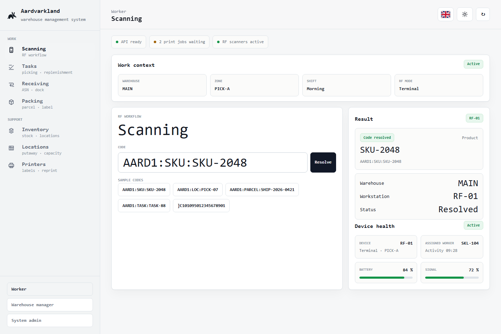</td>
    <td><strong>Worker task workflow</strong><br>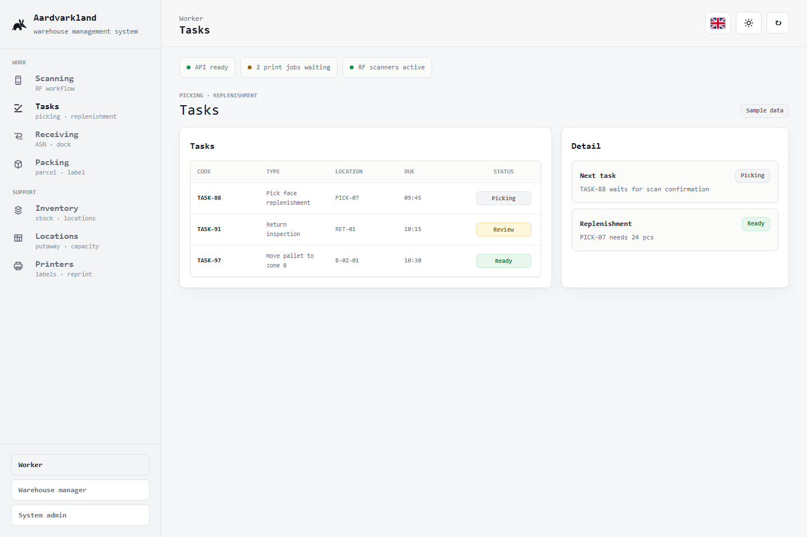</td>
  </tr>
  <tr>
    <td><strong>Inventory</strong><br>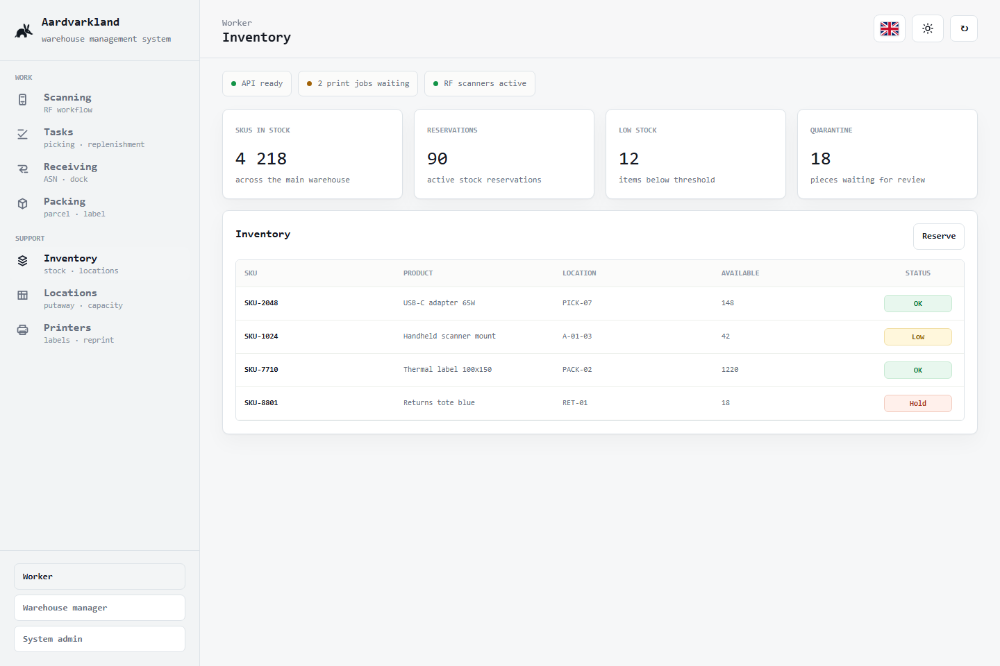</td>
    <td><strong>Scanner fleet and print queue</strong><br>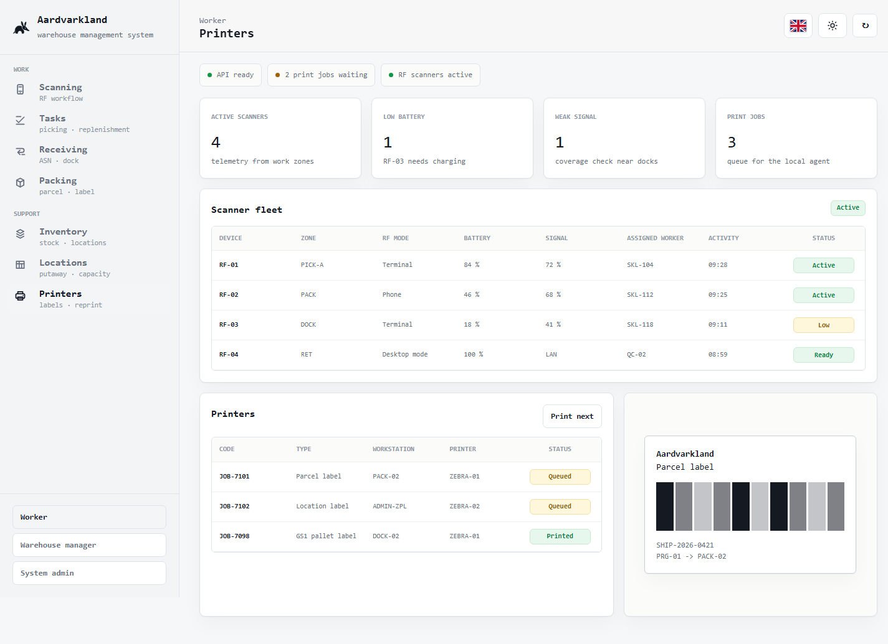</td>
  </tr>
  <tr>
    <td><strong>Manager overview</strong><br>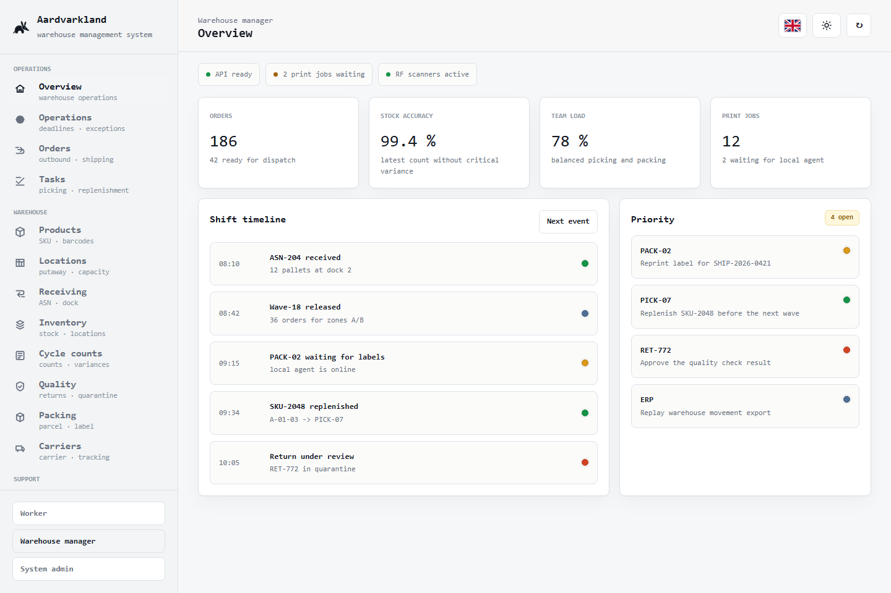</td>
    <td><strong>Control Tower</strong><br>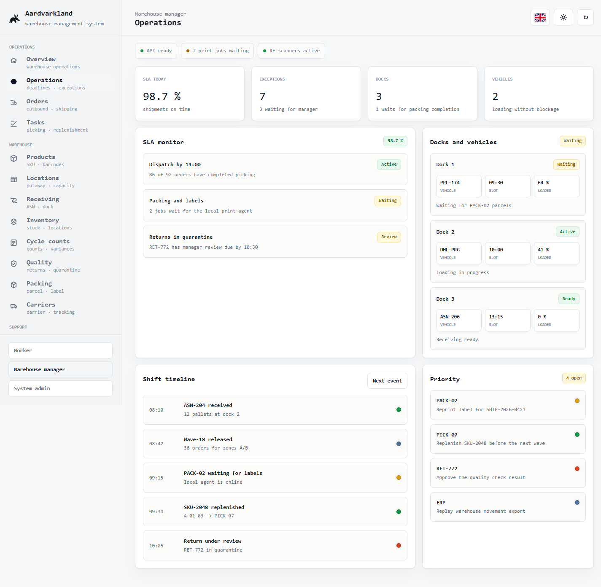</td>
  </tr>
  <tr>
    <td><strong>Admin stability</strong><br>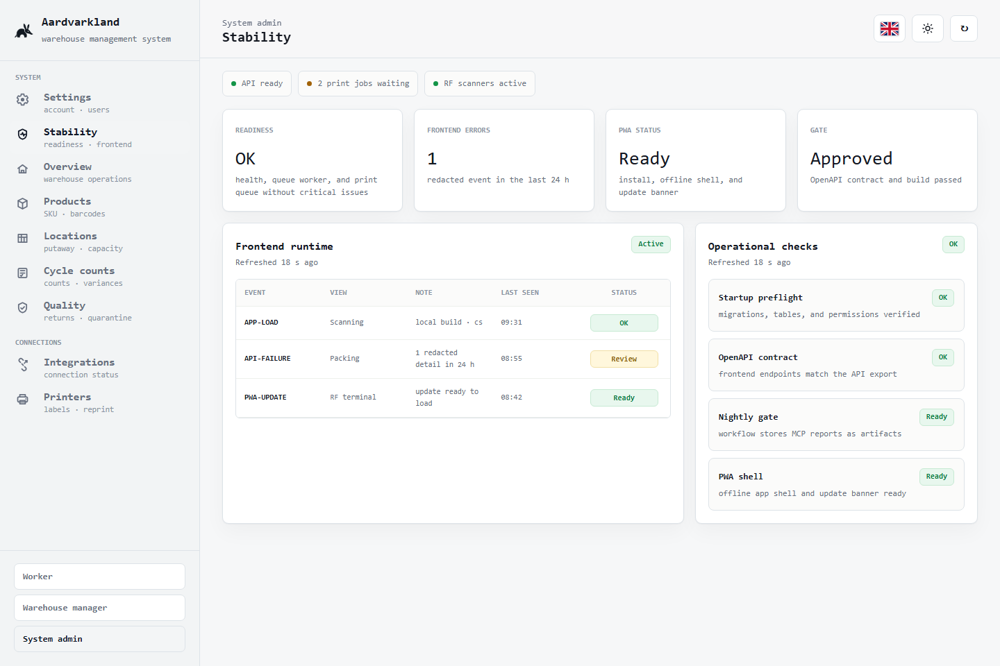</td>
    <td><strong>Admin integrations</strong><br></td>
  </tr>
  <tr>
    <td><strong>Admin overview</strong><br>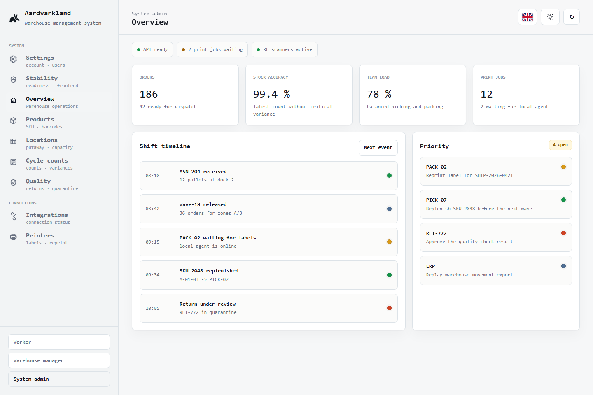</td>
    <td><strong>Mobile RF</strong><br>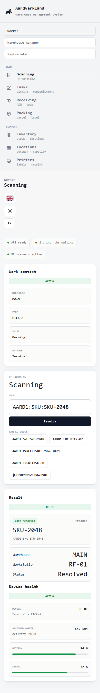</td>
  </tr>
</table>

### What the preview includes

| Area | Available views and workflows |
|---|---|
| Warehouse worker | RF work, tasks, receiving, inventory, locations, packing, and permitted label printing |
| Warehouse manager | Operational overview, queues, cycle counts, quality, scanner fleet health, and Control Tower |
| System administrator | Users, roles, warehouses, integrations, printers, print agents, and platform stability |
| Operations | Warehouse, zone, shift, RF mode, SLA, docks, vehicles, and work context |
| Platform | Czech, English, and Ukrainian UI, light and dark mode, mobile RF, and PWA support |

The role switcher exists only in the public preview so each part of the product can be explored without production credentials. In a deployed environment, roles and permissions are enforced by the backend.

### Product capabilities

Aardvarkland WMS keeps operational rules and system state in the backend. The product includes:

- login, refresh tokens, logout, MFA/TOTP, roles, permissions, and warehouse-scoped access;
- product and SKU master data, barcodes, warehouse locations, inventory, reservations, stock movements, and audit trail;
- receiving, putaway, tasks, RF workflows, scan validation, outbound release, waves, allocation, picking, packing, parcels, and shipping;
- returns, quarantine, quality checks, cycle counts, and variance approval;
- ZPL templates, print jobs, printers, and local Print Agent support;
- integrations, outbox, idempotency, carriers, and shipment tracking;
- health and readiness endpoints, startup checks, graceful shutdown, alerting, incident state, recovery status, retention cleanup, audit export, and database guardrails;
- PWA and RF application shells, frontend runtime observability, OpenAPI contract checks, and full-stack verification.

### Roles

**Worker** handles RF tasks, receiving, packing, inventory, locations, and label printing within assigned permissions.

**Warehouse manager** oversees operations, orders, tasks, queues, cycle counts, quality, reprints, scanner fleet health, Control Tower, and integration status.

**System administrator** manages users, roles, warehouses, APIs and integrations, printers, print agents, templates, and platform reliability.

### Product footprint

Reference measurement from 2026-05-25:

| Scope | Files | Lines |
|---|---:|---:|
| Backend — clean product code | 550 | 65,345 |
| Backend — total application scope | 596 | 71,951 |
| Frontend — clean product code | 77 | 15,601 |
| Frontend — total application scope | 92 | 16,059 |
| Combined — clean product code | 627 | 80,946 |
| Combined — total application scope | 688 | 88,010 |

Clean product code counts the product source itself. Total application scope also includes tests, migrations, configuration, scripts, examples, and local documentation. It excludes dependencies, build output, the generated Prisma client, `backend/openapi.json`, lockfiles, logs, generated reports, binary assets, model files, and backup artifacts.

### Public repository boundary

This repository presents the product without publishing the full production source tree. It does not include production backend and frontend source code, `.env` files, tokens, passwords, database dumps, live operational data, or private customer and deployment materials.

The public preview is therefore not a limited version of Aardvarkland WMS. It is a separate presentation environment for the full product.

All rights reserved by Aardvarkland Inc.
