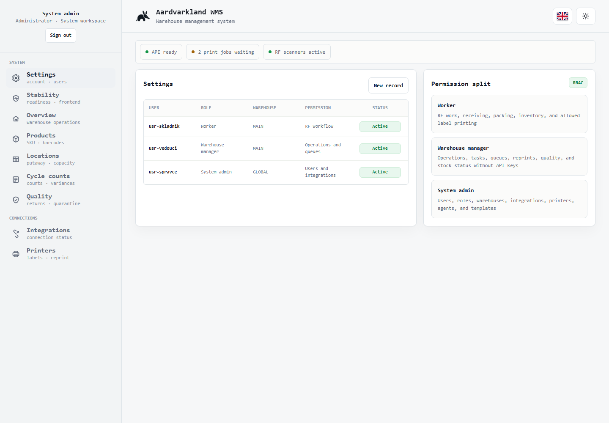
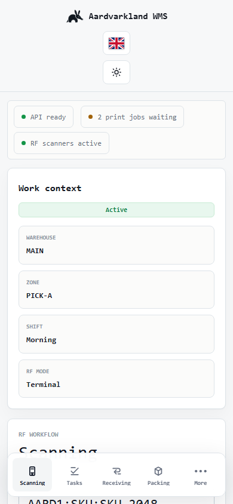
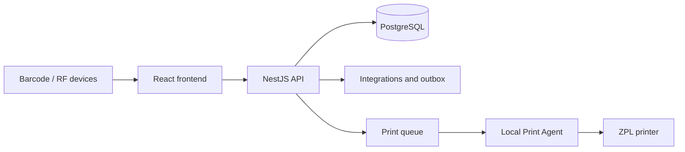

# Aardvarkland WMS

Open-source warehouse management system for inventory, receiving, picking, packing, shipping, barcode workflows, printing, and warehouse operations.

[Live Demo](https://maxmilianbaron.github.io/Aardvarkland-WMS/) · [Screenshots](#screenshots) · [Quick Start](#quick-start) · [Documentation](docs/) · [WMS Mini](https://github.com/MaxmilianBaron/Aardvarkland-WMS-Mini)


## Overview

Aardvarkland WMS is a self-hosted, full-stack warehouse management platform. A React frontend supports warehouse workers, managers, and system administrators; a NestJS API and PostgreSQL database own inventory, permissions, workflows, integrations, audit data, and operational state.

## Why this project?

- Keep receiving, putaway, picking, packing, shipping, and inventory in one system.
- Support keyboard-wedge and camera barcode workflows plus RF-oriented screens.
- Route ZPL print jobs through a local Print Agent instead of browser-only printing.
- Run on your own infrastructure with explicit configuration and operational controls.
- Inspect and extend the complete TypeScript source under the MIT License.

## Features

- Product, warehouse, location, inventory, reservation, and cycle-count management
- Inbound receiving and putaway workflows
- Outbound allocation, wave picking, packing, parcels, and shipping
- Role-based access for workers, warehouse managers, and system administrators
- Barcode resolution, scanner telemetry, label templates, and ZPL print queues
- Control Tower, analytics, incidents, alerts, readiness, and audit exports
- Czech, English, Ukrainian, French, German, and Spanish interfaces
- Docker-based local stack and Windows operational scripts

## Screenshots

The live demo uses safe sample data and does not connect to a production backend.

| Dashboard and role workflow | Mobile warehouse view |
| --- | --- |
|  |  |

## Live Demo

Try the interactive product preview at [maxmilianbaron.github.io/Aardvarkland-WMS](https://maxmilianbaron.github.io/Aardvarkland-WMS/). It demonstrates the interface with browser-only sample data; the source in this repository is the full application.

## Quick Start

Prerequisites: Docker Desktop with Compose, or Node.js 24.15+ and PostgreSQL 18.

```bash
git clone https://github.com/MaxmilianBaron/Aardvarkland-WMS.git
cd Aardvarkland-WMS
docker compose up --build
```

Open the frontend at `http://localhost:4000`. The API is available at `http://localhost:4001/api`.

## Installation

For a native development setup:

```bash
cd backend
npm ci
npm run prisma:generate
cd ../frontend
npm ci
```

Copy `backend/.env.example` to `backend/.env` for local development and replace every placeholder before using a shared or production environment. Never commit the resulting `.env` file.

## Configuration

Runtime options are documented in [`backend/.env.example`](backend/.env.example) and [`backend/.env.production.example`](backend/.env.production.example). The local Compose defaults are deliberately development-only. Generate unique database, JWT, MFA, webhook, and administrator secrets for every deployment.

## Development

```bash
# terminal 1
cd backend
npm run start:dev

# terminal 2
cd frontend
npm run dev
```

The frontend defaults to port `4000`; the API defaults to port `4001` with the `/api` prefix.

## Testing

```bash
cd backend
npm run verify

cd ../frontend
npm run typecheck
npm run lint
npm test
npm run build

cd ../print-agent
npm ci
npm run check
```

Hardware simulators and role journeys live in `MCP/`. Software simulation does not replace acceptance testing with real scanners and printers.

## Building

```bash
cd backend && npm run build
cd ../frontend && npm run build
```

For the full containerized stack, run `docker compose build`.

## Architecture



The backend is the source of truth for permissions, inventory, workflows, audit data, and print jobs. See [`docs/`](docs/) for operational details.

## Project Structure

- `backend/` — NestJS API, Prisma schema, migrations, tests, and OpenAPI export
- `frontend/` — React/Vite application and PWA shell
- `print-agent/` — local ZPL printer bridge
- `MCP/` — repeatable role, workflow, and hardware simulations
- `scripts/`, `service/` — deployment, backup, acceptance, and Windows service tooling
- `demo/` — independent GitHub Pages product preview
- `docs/` — architecture, operations, reliability, and deployment documentation

## Roadmap

- Complete independent security and production-readiness review
- Expand hardware acceptance across supported scanner and printer models
- Add more deployment examples and observability integrations
- Improve contributor-facing examples and end-to-end test coverage

## Contributing

See [CONTRIBUTING.md](CONTRIBUTING.md) for setup, testing, and pull-request guidance.

## Security

Please report vulnerabilities privately as described in [SECURITY.md](SECURITY.md).

## Related Projects

Looking for a smaller, one-device implementation? See [Aardvarkland WMS Mini](https://github.com/MaxmilianBaron/Aardvarkland-WMS-Mini). For cash counting and till closing, see [Aardvarkland CashTally](https://github.com/MaxmilianBaron/Aardvarkland-CashTally).

## License

Licensed under the [MIT License](LICENSE).

If you find this project useful, consider giving it a star — it helps others discover the project.
